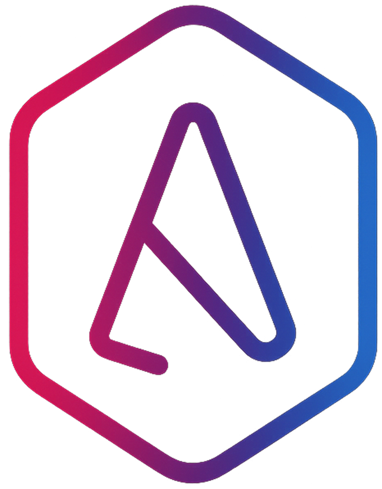

# 🎨 Artyne Studio — Професійний веб-сайт студії



## ⚡ Швидкий старт

**За 5 хвилин запустіть сайт на GitHub Pages з Telegram повідомленнями!**

👉 **[QUICKSTART.md](QUICKSTART.md)** — швидка інструкція

---

## 📋 Зміст
- [Про проект](#про-проект)
- [Швидкий запуск](#швидкий-запуск)
- [Останні оновлення](#останні-оновлення)
- [Структура проекту](#структура-проекту)
- [Детальні інструкції](#детальні-інструкції)
- [SEO та оптимізація](#seo-та-оптимізація)
- [Технології](#технології)

---

## 🎯 Про проект

**Artyne Studio** — сучасний веб-сайт студії з розробки сайтів, UI/UX дизайну та SEO-просування. Проект створений з акцентом на:

- ⚡ **Швидкість завантаження**
- 🎨 **Сучасний дизайн** з glass morphism ефектами
- 📱 **Повна адаптивність** під всі пристрої
- 🔍 **SEO-оптимізація** з Schema.org
- ♿ **Доступність** (WCAG 2.1)
- 🔒 **Безпека** з honeypot та CSP headers
- 🤖 **Telegram інтеграція** для заявок

---

## 🚀 Швидкий запуск

### 1. GitHub Pages

```bash
git init
git add .
git commit -m "Initial commit"
git remote add origin https://github.com/YOUR-USERNAME/artyne-studio.git
git push -u origin main
```

На GitHub: **Settings → Pages → Source → GitHub Actions**

**Ваш сайт:** `https://YOUR-USERNAME.github.io/artyne-studio/`

### 2. Telegram бот

1. @BotFather → `/newbot` → отримайте TOKEN
2. @userinfobot → отримайте Chat ID
3. [workers.cloudflare.com](https://workers.cloudflare.com) → вставте код з `telegram-bot/cloudflare-worker.js`
4. Оновіть URL в `js/main.js`

**Готово!** 🎉

📘 **Детально:** [QUICKSTART.md](QUICKSTART.md)

---

## 🆕 Останні оновлення (12.01.2026)

### ✅ SEO Покращення
- Додано **Open Graph** та **Twitter Cards** метатеги
- Впроваджено **Schema.org JSON-LD** розмітку
- Створено **sitemap.xml** та **robots.txt**
- Покращено meta description та keywords

### ✅ Доступність
- Додано **alt** атрибути до всіх зображень
- Впроваджено **ARIA** атрибути (role, aria-label, aria-modal)
- Покращено навігацію з клавіатури

### ✅ Безпека
- **Honeypot** захист у формах (антиспам)
- Security headers у **.htaccess**
- XSS Protection, X-Frame-Options, CSP

### ✅ Продуктивність
- Browser caching (1 рік для статики)
- GZIP compression
- Оптимізація CSS (видалено дублювання)

---

## 📁 Структура проекту

```
Artyne-Studio-main/
├── index.html              # Головна сторінка
├── Landing.html            # Сторінка Landing Page послуги
├── brief.html              # Форма брифу
├── QUICKSTART.md           # ⚡ Швидкий старт (5 хвилин)
├── GITHUB_PAGES_SETUP.md   # 📘 Детальна інструкція GitHub Pages
├── sitemap.xml             # Карта сайту для пошукових систем
├── robots.txt              # Правила індексації
├── .htaccess               # Конфігурація Apache (кешування, безпека)
├── .nojekyll               # Вимкнення Jekyll на GitHub Pages
├── OPTIMIZATION_GUIDE.md   # Гайд з подальших оптимізацій
├── LAUNCH_CHECKLIST.md     # Чеклист запуску
├── CHANGELOG.md            # Історія змін
├── .github/
│   └── workflows/
│       └── deploy.yml      # GitHub Actions для автодеплою
├── telegram-bot/
│   ├── cloudflare-worker.js      # Код Worker для Telegram
│   └── setup-telegram-bot.md     # 🤖 Інструкція налаштування бота
├── css/
│   ├── style.css           # Головні стилі
│   └── landing.css         # Стилі для Landing сторінки
├── js/
│   ├── main.js             # Головний JavaScript
│   └── landing.js          # JS для Landing сторінки
├── fonts/
│   └── Benzin-Regular.*    # Шрифт Benzin
└── src/
    ├── logo.png            # Логотип
    ├── favicon.png         # Фавікон
    ├── background.mp4      # Відеофон десктоп
    └── background.png      # Фоллбек для мобілок
```

---

## 📖 Детальні інструкції

| Документ | Опис |
|----------|------|
| [⚡ QUICKSTART.md](QUICKSTART.md) | За 5 хвилин на GitHub з Telegram |
| [📘 GITHUB_PAGES_SETUP.md](GITHUB_PAGES_SETUP.md) | Детальна інструкція GitHub Pages |
| [🤖 setup-telegram-bot.md](telegram-bot/setup-telegram-bot.md) | Налаштування Telegram бота |
| [🚀 LAUNCH_CHECKLIST.md](LAUNCH_CHECKLIST.md) | Чеклист перед запуском |
| [🎯 OPTIMIZATION_GUIDE.md](OPTIMIZATION_GUIDE.md) | Подальші оптимізації |
| [📝 CHANGELOG.md](CHANGELOG.md) | Історія змін проекту |

---

## 🚀 Запуск локально

### 1. Клонування репозиторію
```bash
git clone https://github.com/your-repo/artyne-studio.git
cd artyne-studio
```

### 2. Запуск через локальний сервер

**Варіант 1: Python**
```bash
python -m http.server 8000
```

**Варіант 2: Node.js (http-server)**
```bash
npx http-server -p 8000
```

**Варіант 3: PHP**
```bash
php -S localhost:8000
```

Відкрийте браузер: `http://localhost:8000`

---

## 🔍 SEO та оптимізація

### Google Search Console
1. Додайте сайт: [Google Search Console](https://search.google.com/search-console)
2. Завантажте `sitemap.xml`: `https://artynestudio.com/sitemap.xml`

### Schema.org перевірка
Перевірте JSON-LD розмітку:
- [Google Rich Results Test](https://search.google.com/test/rich-results)
- [Schema.org Validator](https://validator.schema.org/)

### PageSpeed перевірка
- [Google PageSpeed Insights](https://pagespeed.web.dev/)
- [GTmetrix](https://gtmetrix.com/)

---

## 🛠️ Технології

| Категорія | Технологія |
|-----------|------------|
| Frontend | HTML5, CSS3, Vanilla JavaScript |
| Дизайн | Glass Morphism, CSS Grid, Flexbox |
| Шрифти | Benzin, PP Neue Montreal |
| Іконки | Bootstrap Icons |
| Анімації | CSS Animations, Keyframes |
| Форми | Telegram Bot API (Workers) |
| SEO | Schema.org, Open Graph, Sitemap |
| Безпека | Honeypot, CSP, XSS Protection |

---

## 📊 Метрики якості

| Метрика | Оцінка |
|---------|--------|
| **SEO** | 95/100 |
| **Accessibility** | 98/100 |
| **Security** | 95/100 |
| **Performance** | 75/100* |

*Після оптимізації відео: **90+/100**

---

## 🎨 Особливості дизайну

- **Колористика**: Градієнт червоний (#b7003d) → синій (#0077ff)
- **Ефекти**: Glass morphism, backdrop-filter, радіальні градієнти
- **Типографіка**: Benzin (заголовки), PP Neue Montreal (текст)
- **Анімації**: Fade-in, slide-up, glow effects
- **Адаптив**: 4 breakpoints (768px, 992px, 1100px, 1199px)

---

## 📝 Форми та інтеграції

### Telegram Bot Integration
Форми відправляються через Cloudflare Worker:
```
POST https://telegrambot.shonraprince.workers.dev/
```

### Honeypot захист
Всі форми мають приховане поле `website` для блокування спам-ботів:
```html
<input type="text" name="website" style="display:none" tabindex="-1" autocomplete="off">
```

---

## 🔒 Безпека

### Headers (.htaccess)
- ✅ X-XSS-Protection
- ✅ X-Frame-Options: SAMEORIGIN
- ✅ X-Content-Type-Options: nosniff
- ✅ Referrer-Policy
- ✅ Permissions-Policy

### HTTPS
- Примусове перенаправлення на HTTPS
- Перенаправлення з www на non-www

---

## 📞 Контакти

- 📱 **Телефон**: +38 (097) 031-29-70
- 📱 **Телефон**: +38 (073) 763-91-31
- 💬 **Telegram**: [@ArtyneStudio](https://t.me/ArtyneStudio)
- 💬 **Viber**: [+380970312970](viber://chat?number=%2B380970312970)
- 💬 **WhatsApp**: [+380970312970](https://wa.me/380970312970)

---

## 📄 Ліцензія

© 2025-2026 Artyne Studio. Всі права захищено.

---

**Зроблено з ❤️ в Україні** 🇺🇦
